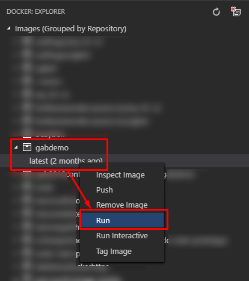
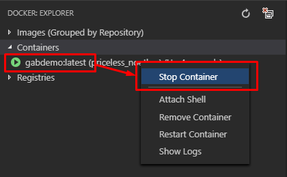

![gablogo][gablogo]

# Lab 3 - Docker Container part 1

## Goal

We will package the Application in a Docker container. Run it locally. Deploy manualy to Azure using Azure CLI

## Let's code!

In this lab, we will execute the following steps:

1. Make our project ready for docker
1. Build our first Docker image
1. Run our dockerized application locally
1. Learn how to stop our running container
1. Deploy our dockerized application to Azure

### Setup docker using Docker extension

We will first create a `Dockerfile` using the VS Code Docker extension:

1. Open VS Code command palette (`ctrl+shift+p`).
1. Select `Docker: Add Docker Files to Workspace`.
1. [optional] If you are in a Workspace, select the folder that you want to create the `Dockerfile` into.
1. Select `ASP.NET Core` as the Application Platform.
1. Select `Linux` as the Operating System.
1. Hit `Enter` and select the default `80` port for the application to listen to (any other port of your choosing should work as well).
1. [optional] if you have multiple projects, select the application `.csproj` file.


This should have created a `Dockerfile` similar to (assuming your application is named `MyBootcamp2019App` and the `MyBootcamp2019App.csproj` file is at the same level as the `Dockerfile`):

```dockerfile
FROM microsoft/dotnet:2.2-aspnetcore-runtime AS base
WORKDIR /app
EXPOSE 80

FROM microsoft/dotnet:2.2-sdk AS build
WORKDIR /src
COPY ["MyBootcamp2019App.csproj", "./"]
RUN dotnet restore "./MyBootcamp2019App.csproj"
COPY . .
WORKDIR "/src/."
RUN dotnet build "MyBootcamp2019App.csproj" -c Release -o /app

FROM build AS publish
RUN dotnet publish "MyBootcamp2019App.csproj" -c Release -o /app

FROM base AS final
WORKDIR /app
COPY --from=publish /app .
ENTRYPOINT ["dotnet", "MyBootcamp2019App.dll"]
```

This should have created a `Dockerfile` similar to (assuming your application is named `GlobalAzureBootcamp-2019-App` and the `GlobalAzureBootcamp-2019-App.csproj` file is located in a `src/GlobalAzureBootcamp-2019-App/` directory, relative to the `Dockerfile`):

```dockerfile
FROM microsoft/dotnet:2.2-aspnetcore-runtime AS base
WORKDIR /app
EXPOSE 80

FROM microsoft/dotnet:2.2-sdk AS build
WORKDIR /src
COPY ["src/GlobalAzureBootcamp-2019-App/GlobalAzureBootcamp-2019-App.csproj", "src/GlobalAzureBootcamp-2019-App/"]
RUN dotnet restore "src/GlobalAzureBootcamp-2019-App/GlobalAzureBootcamp-2019-App.csproj"
COPY . .
WORKDIR "/src/src/GlobalAzureBootcamp-2019-App"
RUN dotnet build "GlobalAzureBootcamp-2019-App.csproj" -c Release -o /app

FROM build AS publish
RUN dotnet publish "GlobalAzureBootcamp-2019-App.csproj" -c Release -o /app

FROM base AS final
WORKDIR /app
COPY --from=publish /app .
ENTRYPOINT ["dotnet", "GlobalAzureBootcamp-2019-App.dll"]
```

Depending on your project structure, you may end up with a slightly different `Dockerfile`.

### Build our first Docker image

The next step is to build the docker image of your application as follow:

1. Open VS Code command palette (`ctrl+shift+p`).
1. Select `Docker: Build Image`.
1. [optional] If you are in a Workspace, select the folder that you created the `Dockerfile` into.
1. Hit enter to acknowledge the default tag name of `[your application]:latest`.
1. Wait for Docker to complete; this may take a few minutes the first time, but don't worry, it gets way faster afterward.

### Run our dockerized application locally

To run your dockerized application using Docker Explorer, do:

1. In VS Code, click on the `Docker icon` (left). 
1. Under `Images`, locate the image you created and `right-click` on it then select `Run`. _The running container should appear under `Containers`._
1. Browse to `http://localhost` to enjoy navigating your newly dockerized website.



### Learn how to stop our running container

To stop the container using Docker Explorer, you can simply:

1. In VS Code, click on the `Docker icon` (left).
1. Under `Images`, locate the image you created and `right-click` on it then select `Stop Container`. _The running container should then disappear from under `Containers`._



### Deploy our dockerized application to Azure

TODO: ...

## Reference

## End

[Previous Lab](../Lab2/README.md)

[Next Lab](../Lab4/README.md)

[gablogo]: ../medias/GlobalAzureBootcamp2019.png 'Global Azure Bootcamp 2019'
