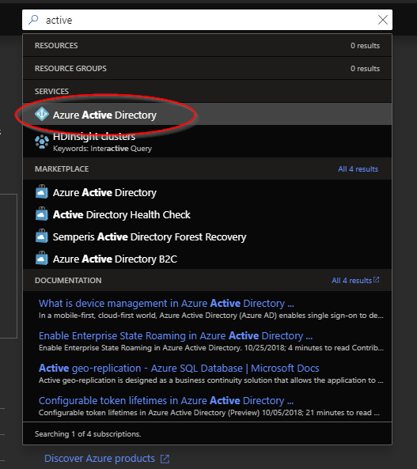
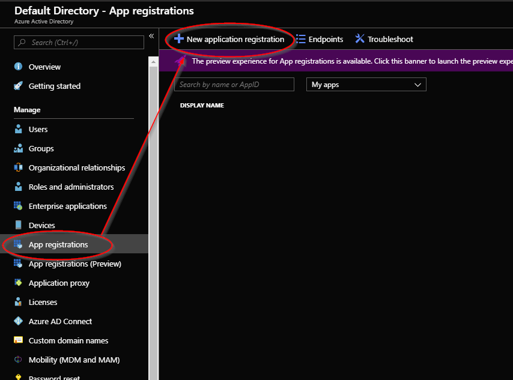

![gablogo][gablogo]

# Lab 7 - Security - KeyVault

## Goal

Add a KeyVault to the ARM template. migrate the API and storage keys to the keyvault. Use the keyvault instead of the keys in the ARM template and application.

## Let's code!

- [Lab 7 - Security - KeyVault](#lab-7---security---keyvault)
  - [Goal](#goal)
  - [Let's code!](#lets-code)
  - [1. Create an identity for the App](#1-create-an-identity-for-the-app)
  - [2. Create a KeyVault to store secrets](#2-create-a-keyvault-to-store-secrets)
  - [3. Give the app access to the KeyVault's secrets](#3-give-the-app-access-to-the-keyvaults-secrets)
  - [4. Move storage account key to KeyVault](#4-move-storage-account-key-to-keyvault)
  - [5. Modify the app to get the Storage Account Keys from KeyVault](#5-modify-the-app-to-get-the-storage-account-keys-from-keyvault)
  - [6. Optional: try to do the same thing with the ComputerVision API key](#6-optional-try-to-do-the-same-thing-with-the-computervision-api-key)
  - [Reference](#reference)
  - [End](#end)

## 1. Create an identity for the App

In order to access different azure services our app will need an identity.

1. Login to the [azure portal](https://portal.azure.com)
2. Use the search bar to get to the "Active Directory" service



3. On the left side select "App registrations" then click on "New application registration



4. Select a name and assign a Sign-on URL (can be anything and doesn't need to point to a valid website)


5. Create a key for you app, click on settings, then keys, then add a new key and click save


6. Copy the Application ID, object Id and the newly created key value in a notepad, we'll need them later


## 2. Create a KeyVault to store secrets

1. Open the ARM template we created in [Lab2](../Lab2/README.md)
1. Add a new resource for KeyVault

```json
{
    "type": "Microsoft.KeyVault/vaults",
    "apiVersion": "2018-02-14",
    "name": "[parameters('keyVaultName')]",
    "location": "[resourceGroup().location]",
    "properties": {
        "enabledForDeployment": true,
        "enabledForTemplateDeployment": true,
        "enabledForDiskEncryption": true,
        "tenantId": "[subscription().tenantId]",
        "accessPolicies": [],
        "sku": {
            "name": "standard",
            "family": "A"
        },
        "resources": [],
        "dependsOn": []
    }
}
```
> TIP: note that we are using template expressions like `[resourceGroup().location]` and `[subscription().tenantId]` to fill out automatically some values relative to the location where the resource will be deployed.
3. Add a new parameter named `keyVaultName` and select a default value

```json
"keyVaultName": {
    "defaultValue": "gabc-key-vault",
    "type": "string"
}
```

4. Run the script to deploy a KeyVault

## 3. Give the app access to the KeyVault's secrets
In order to retrieve a secret from KeyVault you need to give explicit permission.
1. Modify the ARM template to add an access policy that will give access to our app
```json
"accessPolicies": [
{
    "tenantId" : "[subscription().tenantId]",
    "objectId": "[parameters('applicationObjectId')]",
    "permissions": {
        "secrets": [
            "get",
            "list"
        ]
    }
}]
```
3. Add a new parameter named `applicationObjectId` and set the default value to the `ObjectId` we got from [Step 1.6](#1-Create-an-identity-for-the-App)

```json
"applicationObjectId": {
    "defaultValue": "<YOUR OBJECT ID VALUE HERE>",
    "type": "string"
}
```

## 4. Move storage account key to KeyVault
Wouldn't it be great if the ARM template could provision the Storage Account and save the dynamically generated access keys to keyVault? Let's see how to do it!
1. Modify the ARM template to add a new resource
```json
{
    "type": "Microsoft.KeyVault/vaults/secrets",
    "name": "[concat(parameters('keyVaultName'), '/Keys-Storage-ConnectionString')]",
    "apiVersion": "2016-10-01",
    "location": "[resourceGroup().location]",
    "properties": {
        "value": "[listKeys(resourceId('Microsoft.Storage/storageAccounts', parameters('storageAccountName')), providers('Microsoft.Storage', 'storageAccounts').apiVersions[0]).keys[0].value]"
    },
    "resources": [],
    "dependsOn": []
}
```

This resource will create a new secret in key vault by retrieving automatically the value from the storage account once it's provisioned

## 5. Modify the app to get the Storage Account Keys from KeyVault
Alright now that everything is provisioned correctly in azure, it's time to modify the web application and get the secret from KeyVault instead of using an hardcoded value.

5.1 install the Azure key vault package with `dotnet add package Microsoft.Extensions.Configuration.AzureKeyVault`

5.2 Open `program.cs` and modify the `CreateWebHostBuilder` method to
```csharp
public static IWebHostBuilder CreateWebHostBuilder(string[] args) =>
    WebHost.CreateDefaultBuilder(args)
        .ConfigureAppConfiguration((context, config) =>
        {
            var builtConfig = config.Build();

            config.AddAzureKeyVault(
                $"https://{builtConfig["Keys:KeyVault:Name"]}.vault.azure.net/",
                builtConfig["Keys:KeyVault:AzureADApplicationId"],
                builtConfig["Keys:KeyVault:AzureADPassword"]);
        })
        .UseStartup<Startup>();
```

5.3 Open `appsettings.json` and remove `Keys:Storage:ConnectionString` as it will not be loaded from your key vault.
While you're there add the following keys to your `appsetting.json`


```json
{
  "Keys": {
      "KeyVault":{
        "Name": "<YOUR KEYVAULT NAME HERE>",
        "AzureADApplicationId": "<YOUR KEYVAULT AzureADApplicationId HERE>",
        "AzureADPassword": "<YOUR KEYVAULT AzureADPassword HERE>"
    }
  }
}
```


5.4 Run the application and make sure everything still work


## 6. Optional: try to do the same thing with the ComputerVision API key 


## Reference

- [[listkeys()] function](https://docs.microsoft.com/en-us/rest/api/storagerp/storageaccounts/listkeys?WT.mc_id=globalazure-github-frbouche)
- [KeyVault](https://azure.microsoft.com/en-ca/services/key-vault/?WT.mc_id=globalazure-github-frbouche)
- [Azure Key Vault Configuration Provider in ASP.NET Core](https://docs.microsoft.com/en-us/aspnet/core/security/key-vault-configuration?WT.mc_id=globalazure-github-frbouche&view=aspnetcore-2.2)

## End

[Previous Lab](../Lab6/README.md)

[gablogo]: ../medias/GlobalAzureBootcamp2019.png "Global Azure Bootcamp 2019"
